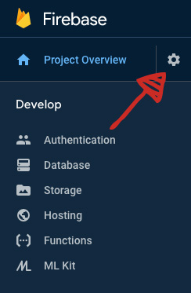
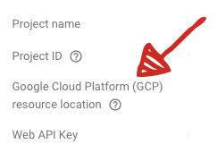
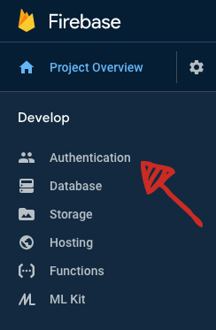
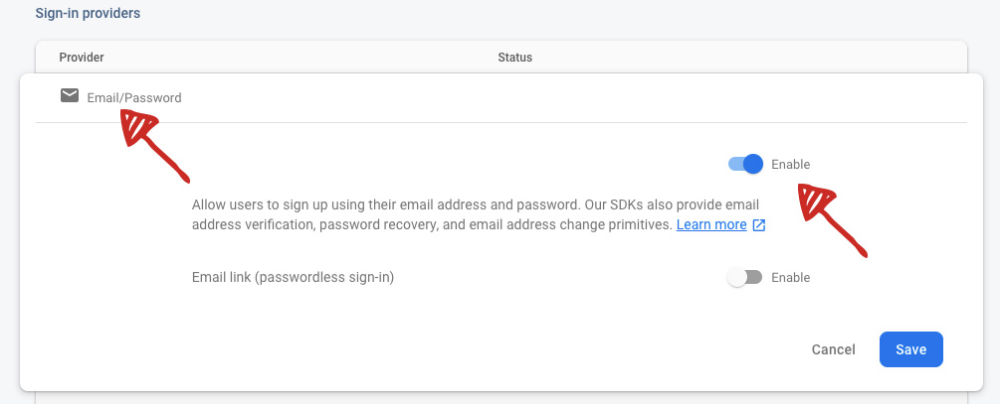
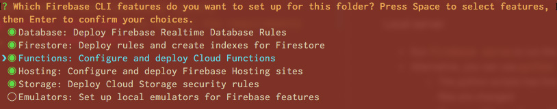

# #TOS - TweetsOnScreen

## The Problem
Advertisers often want to present tweets in custom ways, customized designs, animations or even as prints or audio. Moderation is required to ensure the safety of the content. Most of the existing solutions in the market offer moderation and API for further implementation. However, they do not provide software development services to customize the presentation layer. Advertisers need to engage another software vendor who knows how to integrate with the API. Many advertisers gave up because there are too many parties involved. 

## The Solution
#TOS aims to provide a turnkey solution for advertisers to curate and present tweets. It is an open source based solution for any agency partner to download, deploy and customize. Here's a [recorded video](https://photos.app.goo.gl/wTKfKtNNPwGyXneC9) of the solution. There are 3 components. 

### Curation (Chrome Extension)
A Chrome extension is developed for the curators to shortlist tweets. The extension tweaks twitter.com by adding a "shortlist button" for each tweet. That button will send the tweet for final moderation, the approval panel.

### Approval (Web)
A web page is provided for advertisers to make a final decision which curated tweets should be featured. The 2 step (curate then approve) process is designed to tackle projects with high volume of content. Advertisers can engage multiple curators to look through more content. The process also reduces human errors.

[Online Demo](https://tweets-on-screen.web.app) 

### Presentation (Web and beyond)
Most projects use HTML as output format. At the moment, the project includes 2 default layouts implemented in JavaScript and CSS. It also offers a JavaScript library to build further customizations. Because of its open source nature, presentation implementations will grow by community's contribution.

[Online Demo: Display Wall](https://tweets-on-screen.web.app/display-wall.html)
[Online Demo: Single Tweet](https://tweets-on-screen.web.app/display-single.html)

## Technical specifications
#TOS uses JavaScript as the main programming language and Firebase for database, user authentication and hosting. There are also some python scripts to facilitate development but it is optional to use them.

## About Firebase
Firebase is product of Google Cloud Platform. Originally known for its push notification and analytics services. #TOS uses Firebase for its the cloud computing services. 

### Firestore
Firestore is a database as service product. It serves as the database layer without the need to setup any traditional hosting environment like PHP or Python etc. Firestore can be accessed using JavaScript in a normal HTML page. Access rights are configured via Firestore's rules. (I often mix up `Firebase` with `Firestore` when Googling about them. I hope you won't have the same problem)

### Hosting
Web pages are hosted via Firebase's static site hosting services, which offers a secure certificate and a individual domain like `project-tos.web.app`. You attach a custom domain but I feel it is not necessary unless the project is meant to be permanent. 

### Fees
All projects are created under the free tier pricing model. The free tier is very generous and it should be able to handle most of the use cases. You can switch to "pay as you go" tier if you foresee heavy usage or just want to enjoy peace of mind.  

## User Guide
### Setup Firebase 
* Sign up a Firebase account at https://firebase.google.com/
* Create a new project (It takes a few minutes for the project to be fully ready)
* Configure project resource region
  * Google cloud has a few datacenters located at different parts of the world. Use the region closest to your project's location for better server speed.
  * Go to `Project Settings` section

    
  * Set `Google Cloud Platform (GCP) resource location`. This cannot be changed once set. Use 'us-central' if unsure which one to choose.
  
    

* Configure the authentication methods
  * Click at the Authentication link

    
  * Click at the "Sign-in Method" link and enable Email/Password sign-in method. 

    

### Setup dev environment
* Firebase requires nodejs. Install nodejs if needed.
  * [Download installer](https://nodejs.org/en/download/) from the office nodejs website  
  * Run the installer
* Install firebase command line tool: `sudo npm install -g firebase-tools`
* There are some script files written in Python 3. They are not compulsory.

### Initialize project
* Download/Clone the CPT project
* In terminal, change to `firebase` folder of the project
* Run `firebase login` and follow the instructions to store the credentials onto your machine. You only need to do this ones. 
* Run `firebase init` to initalize the project
  * Activate `Database`, `Firestore`, `Functions`, `Hosting` and `Storage` features. 

    

  * Select the project created in Firebase's online console
  * Keep pressing enter to use the default settings

### Local server
* Run `firebase serve` to run the local development server
* Alternative, you can use `python server.py`
  * The python scripts has livereload built in, which automatically reloads your browser when files are changed
  * However, this requires python 3 and livereload library
  * You need to run `pip install livereload` to fulfill the requirements
* To deploy the project, run `firebase deploy`

### Adding user accounts 
* A Python script is created for quick add/update user accounts
* Run the script by `python add_user.py` to start it
* Key in the email address of the user
* The account will be created with a randomly generated password
* If the email is already in use, the account's password will be replaced by the newly generated one

## Customization

### Tweaking the look and feel
There are 2 sample codes for displaying tweets, `display-single.html` and `display-wall.htm`. You can view them via local server `http://localhost:8000/display-single.html` and `http://localhost:8000/display-wall.html`. The corresponding files are in `public` folder. It is quite straight forward to customize the CSS portion to change colors, background and sizes etc. If the HTML strucutre is in the way, you have to make changes on the JavaScript level. The easiest way is to make changes on `base.js` file and look for `BaseRenderer`'s `render` function.

### Extending JavaScript
The project is written in vanilla Javascript with ES2015 flavor. It uses `modules` to share codes between the admin and display layers. `base.js` contains the core code.

There are 3 parts of the app. 
1. ### Renderer
    * Responsible for how to display a single tweet as a DOM element
    * It parses the JSON object saved from twitter.com
    * The renderer uses twemoji library to make sure all emojis are rendered in twitter way
    * There are a few functions to customize
      * `trimText`: decide which part of the text is meant to be displayed. The full text contains mentions and links/medias at the end. 
      * `hilightLinks`: add blue color to hilight links, not clickable 
      * `highlightHashtags`: add blue color to hilight hashtags, not clickable
      * `expendMedia`: extract the first image/video in the attached medias. It is possible to extract all images however, it is hard to find a good way to show all of them.
      * `expendVideo`: extract the video asset URL, called within the `expendMedia` function.
      * `render`: calls all the necessary functions and make the DOM element. 
      
2. ### Layout Manager

    * Responsible for the arrangement or sequence to show all the tweets, e.g. how to transit from one to another
    * An instance of layout manager is initialized with an instance of a renderer
    * There are a few functions to customize
      * `addEntry`: add an entry to the page
      * `removeEntry`: remove an entry from the page
      * `clear`: reset the display

2. ### App

    * Responsible for database(firestore) related tasks
    * Monitors changes from the database and passes the changes to its layout manager

## TODOs
### Implement custom emojis (hashflags)
* The full list from twitter.com is too large to be used
* Needs a field to enter a map of hashtag and svg path, e.g. `{"oneteam": "OneTeam_V2Design_Evergreen.png"}`
### Implement media caching
* If a user deletes her/his tweet, the image/video will disappear
* If a user deletes her/his account, the profile image wiil disappear
* Write a Firebase `Function` to download these images and save them into `Storage`

## HOWTOs
### How to install Unpacked Chrome Extension
Currently the Chrome extension is not submitted to Chrome Store. It is to install via as a "unpacked extension". 
* First Download the zip file from online and extract it into a location
* Go to Chrome's `settings` page
* Then click at the `Extensions` link on the left hand side
* Turn on the `develop mode`
* Choose `Load unpacked` option to install the extension

### How to change Firebase's ApiKey
* Unlikely there will be any effect because the solutions requires authentication for `write` permissions
* Just in case you need replace the ApiKey, you can do this via [Google Cloud Console](https://console.developers.google.com/apis/credentials)

### How to autoplay video
* Browsers do not allow video autoplay without users interaction
* When using Chrome, click anywhere on the page will activate video auto-play
* Only for safari, you can overwrite such settings by [following this article](https://www.howtogeek.com/326532/safari-now-disables-auto-playing-videos.-heres-how-to-allow-them-for-certain-sites/)